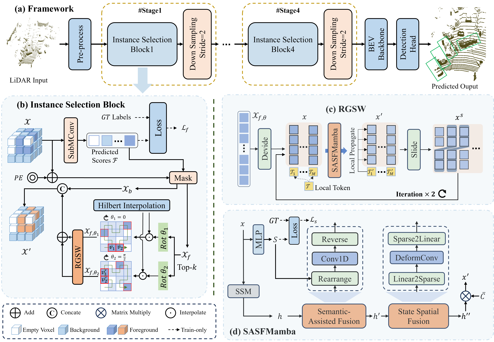

# Fore-Mamba3D: Mamba-based Foreground-Enhanced Encoding for 3D Object Detection

> **ICLR 2026** | Accepted

## Overview

Fore-Mamba3D is a novel backbone architecture for 3D object detection that leverages Mamba-based linear modeling with foreground-enhanced encoding. Existing Mamba-based methods encode the entire scene including abundant background information, which is inefficient. Our method achieves superior performance by focusing on foreground voxels with enhanced contextual representation.

## Key Contributions

1. **Foreground-Enhanced Linear Encoding**: Selects top-k foreground voxels via predicted scores, significantly reducing computational cost while maintaining accuracy

2. **Regional-to-Global Sliding Window (RGSW)**: Aggregates information from local patches to the entire sequence, addressing response attenuation in sparse foreground voxels

3. **SASFMamba Module**: Enhances contextual representation through:
   - **Semantic-Assisted Fusion (SAF)**: Enables long-range interactions between semantically similar voxels
   - **State Spatial Fusion (SSF)**: Recovers geometric information lost in linearization

## Method Overview



The backbone consists of four stages, each containing an instance selection block and a downsampling block. The instance selection block includes foreground voxel sampling, RGSW strategy, and SASFMamba encoder for effective foreground-focused 3D object detection.

## Installation

```bash
git clone https://github.com/yourusername/Fore-Mamba3D.git
cd Fore-Mamba3D

# Create conda environment
conda create -n fore-mamba3d python=3.10
conda activate fore-mamba3d

# Install dependencies
pip install -r requirements.txt

# Install torch with CUDA support (example for CUDA 11.8)
pip install torch torchvision torchaudio --index-url https://download.pytorch.org/whl/cu118
```

## Dataset Preparation

### KITTI Dataset

```bash
# Download KITTI dataset
# Place it in the following structure:
data/kitti/
├── training/
│   ├── calib/
│   ├── image_2/
│   ├── label_2/
│   └── velodyne/
└── testing/
    ├── calib/
    ├── image_2/
    └── velodyne/
```

### nuScenes Dataset

```bash
# Download nuScenes dataset
# Place it in the following structure:
data/nuscenes/
├── samples/
├── sweeps/
├── maps/
└── v1.0-trainval/
```

## Training & Evaluation

```bash
# Multi-GPU training
python -m torch.distributed.launch \
    --nproc_per_node=4 \
    train.py --cfg configs/kitti_train.yaml
```


## Results

### KITTI Validation Set

| Method | Backbone | Car (Hard/Mod/Easy) | Pedestrian (Hard/Mod/Easy) | Cyclist (Hard/Mod/Easy) |
|--------|----------|---------|---------|---------|
| PointPillars | MLP | 79.1 / 75.0 / 68.3 | 52.1 / 43.5 / 41.5 | 75.8 / 59.1 / 52.9 |
| LION | Mamba | 88.6 / 78.3 / 77.2 | 67.2 / 60.2 / 55.6 | 83.0 / 68.6 / 63.9 |
| VoxelMamba | Mamba | 89.1 / 80.8 / 78.1 | 66.0 / 59.7 / 53.7 | 84.2 / 69.1 / 64.8 |
| **Fore-Mamba3D** | **Mamba** | **90.3 / 82.2 / 79.5** | **67.8 / 62.2 / 57.0** | **86.4 / 69.5 / 66.3** |

### nuScenes Validation Set

| Method | Backbone | mAP | NDS |
|--------|----------|-----|-----|
| HEDNet | Transformer | 66.7 | 71.4 |
| SAFDNet | Hybrid | 66.3 | 71.0 |
| Voxel-Mamba | Mamba | 67.5 | 71.9 |
| LION | Mamba | 68.0 | 72.1 |
| FSHNet | Hybrid | 68.1 | 71.7 |
| **Fore-Mamba3D** | **Mamba** | **68.4** | **72.3** |

### Waymo Open Dataset (L2)

| Method | Backbone | Vehicle | Pedestrian | Cyclist | mAP |
|--------|----------|---------|---------|---------|-----|
| Voxel-RCNN | SpCNN | 76.1 / 68.2 | 78.2 / 69.3 | 70.8 / 68.3 | 68.6 |
| LION | Mamba | - / 67.0 | - / 75.4 | - / 71.9 | 71.4 |
| **Fore-Mamba3D** | **Mamba** | **76.3 / 67.8** | **82.1 / 75.6** | **72.8 / 72.2** | **71.9** |

### Performance Highlights

- **KITTI**: Achieves state-of-the-art performance with +1.2% improvement over VoxelMamba on Car class
- **nuScenes**: Validation mAP of 68.4% and Test mAP of 70.1%, outperforming LION and other SOTA methods
- **Waymo**: Competitive results with 71.9% mAP, showing strong generalization across datasets


## Citation

If you find this project useful in your research, please cite:

```bibtex
@article{ning2026foremamba3d,
  title={Fore-Mamba3D: Mamba-based Foreground-Enhanced Encoding for 3D Object Detection},
  author={Ning, Zhiwei and Gao, Xuanang and Cao, Jiaxi and Yang, Runze and Yang, Jie and Liu, Wei and Xu, Huiying and Zhu, Xinzhong},
  journal={arXiv preprint arXiv:2601.xxxxx},
  year={2026}
}
```

## Acknowledgments

This work is partially supported by:
- National Natural Science Foundation of China (Grant No. 62376153, 62402318, 24Z990200676, 62376252)
- Zhejiang Province Leading Geese Plan (2025C02025, 2025C01056)
- Zhejiang Province Province-Land Synergy Program (2025SDXT004-3)


## License

This project is released under the [MIT License](LICENSE).

## Contributing

We welcome contributions from the community. Please feel free to submit pull requests or open issues.

